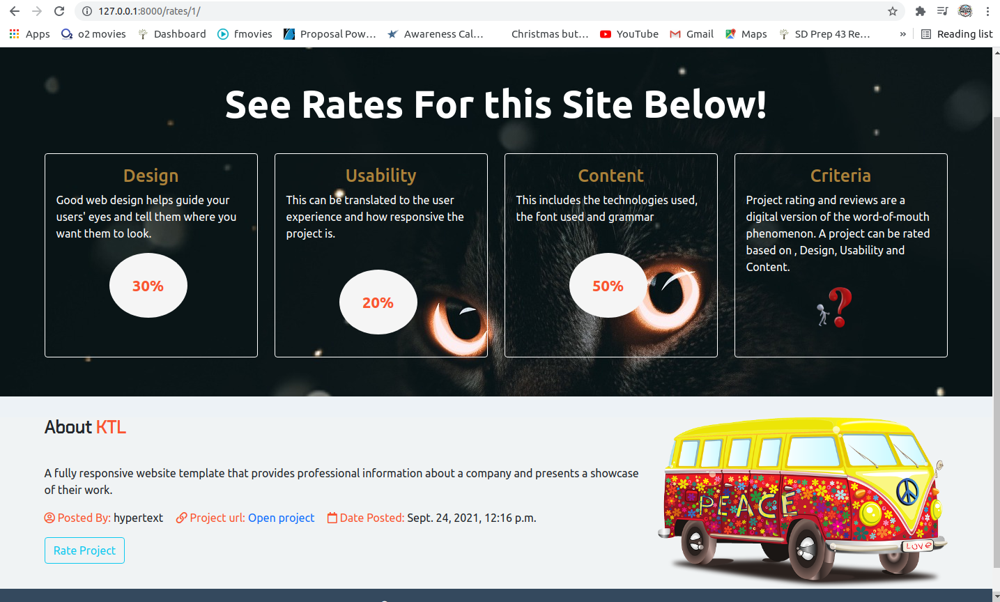

# Project Ratings
## Project Description
pplication rating platform for software developers.

##### By Enock Abere 

### Live link
Visit the application on https://enock-rating.herokuapp.com/
### Setup & Run Instructions
- Create and activate a virtual environment
- Install the dependencies listed in the requirements.txt
- Create a .env file. This will contain environment variables as listed in the .env.sample file.
- Finally, run your app on MODE='dev' config for debugging purposes
### Development
#### Making modifications
To make advancements/modifications, follow these steps:
- Fork the repository
- Create a new branch (git checkout -b improve-feature)
- Make the appropriate changes in the files
- Add changes made
- Commit your changes (git commit -am 'Improve feature')
- Push to the branch (git push origin improve-feature)
- Create a Pull Request
### Technologies Used
Technologies used to develop this application:
- Python v3.9.5
- Django 3.2.7
- Bootstrap5
- HTML
- CSS
- Cloudnary
### Support and contact details
Should you be unable to access the website, have any recommendations and/or questions, feel free to email me:[anock.abere@student.moringaschool.com](mailto:anock.abere@student.moringaschool.com)
### License
    ​Permission is hereby granted, free of charge, to any person obtaining a copy of this software and associated documentation files (the "Software"), to deal in the Software without restriction, including without limitation the rights to use, copy, modify, merge, publish, distribute, sublicense, and/or sell copies of the Software, and to permit persons to whom the Software is furnished to do so, subject to the following conditions:​The above copyright notice and this permission notice shall be included in all copies or substantial portions of the Software.

    ​THE SOFTWARE IS PROVIDED "AS IS", WITHOUT WARRANTY OF ANY KIND, EXPRESS OR IMPLIED, INCLUDING BUT NOT LIMITED TO THE WARRANTIES OF MERCHANTABILITY, FITNESS FOR A PARTICULAR PURPOSE AND NONINFRINGEMENT. IN NO EVENT SHALL THE AUTHORS OR COPYRIGHT HOLDERS BE LIABLE FOR ANY CLAIM, DAMAGES OR OTHER LIABILITY, WHETHER IN AN ACTION OF CONTRACT, TORT OR OTHERWISE, ARISING FROM, OUT OF OR IN CONNECTION WITH THE SOFTWARE OR THE USE OR OTHER DEALINGS IN THE SOFTWARE

Copyright (c) 2021 [Enock Abere](https://github.com/enockabere)  
